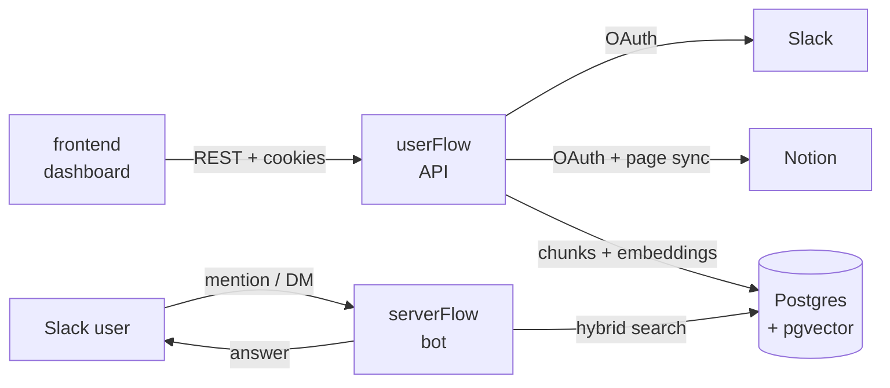

# slackbotfyi

A Slack bot that answers questions from your team's Notion docs. Connect a Notion workspace, index it, and ask the bot questions in Slack — it retrieves relevant chunks and answers using only what's in your docs (RAG), with citations.

## Architecture

Three services share one Postgres database (with `pgvector`):

| Service | What it is | Tech |
|---|---|---|
| [`userFlow/`](./userFlow) | REST API + dashboard backend: Slack/Notion OAuth, triggers Notion indexing, serves stats & docs | Express, Prisma, TypeScript |
| [`serverFlow/`](./serverFlow) | The actual Slack bot: listens for mentions/DMs, runs retrieval, generates answers | Slack Bolt, TypeScript |
| [`frontend/`](./frontend) | Dashboard for connecting Slack/Notion and viewing indexed docs | React, Vite, shadcn/ui |



**Flow:**
1. User logs into the dashboard via Slack OAuth (`userFlow`).
2. User connects a Notion integration and installs the Slack bot into their workspace — both OAuth tokens are encrypted (AES-256-GCM) and stored in `Workspace`.
3. User triggers indexing: `userFlow` walks the Notion workspace, chunks each page's blocks, embeds them (Gemini), and stores them as `DocumentChunk` rows (`pgvector`).
4. A teammate mentions or DMs the bot in Slack: `serverFlow` embeds the question, retrieves chunks via hybrid vector + BM25 search (with neighbor expansion and a Cohere rerank pass), and asks Gemini to answer using only that retrieved context.

## Prerequisites

- Node.js 20+
- PostgreSQL with the `pgvector` extension
- A Slack app (OAuth + bot scopes) — [api.slack.com/apps](https://api.slack.com/apps)
- A Notion integration — [notion.so/my-integrations](https://www.notion.so/my-integrations)
- A Google Gemini API key
- A Cohere API key (used for reranking in `serverFlow`)

## Setup

1. Copy each service's `.env.example` to `.env` and fill in the values (each file documents what it needs):
   ```
   cp userFlow/.env.example userFlow/.env
   cp serverFlow/.env.example serverFlow/.env
   cp frontend/.env.example frontend/.env
   ```
   `TOKEN_ENCRYPTION_KEY` must be the **same value** in `userFlow/.env` and `serverFlow/.env`. Generate one with:
   ```
   node -e "console.log(require('crypto').randomBytes(32).toString('base64'))"
   ```

2. Install dependencies and run migrations:
   ```
   cd userFlow && npm install && npx prisma migrate deploy
   cd ../serverFlow && npm install
   cd ../frontend && npm install
   ```

3. Run each service (separate terminals):
   ```
   cd userFlow && npm run dev      # API on :3000
   cd serverFlow && npm run dev    # Slack bot on :5000
   cd frontend && npm run dev      # dashboard on :5173
   ```

## Docker

`docker-compose.yml` runs `userFlow` and `serverFlow` from prebuilt images (published by `.github/workflows/docker.yml` on push to `main`), each reading its own `.env` file:

```
docker compose up -d
```

The frontend isn't part of the compose file — deploy it separately (e.g. static hosting), pointed at wherever `userFlow` is reachable.

## License

MIT — see [LICENSE](./LICENSE).
